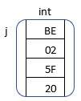
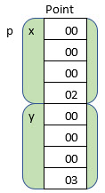
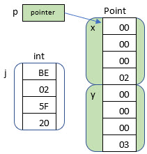
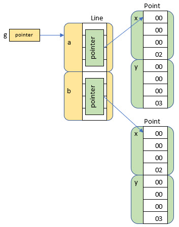

## Structure (of Data)

The computer hardware understands very primitive data types. A single byte is 8 bits and can hold a number
between 0 and 255. That was all early CPUs, like the 6502, could work with. As the years went by,
processors got bigger and smarter. Modern processors can work with 32 and 64 bytes at a
time. These allow our variables to hold much larger numbers -- but they are still just numbers.

The data of our lives is usually more complicated than a single number.

A point on the computer screen, for instance, is two numbers: an X and a Y coordinate.

A line is defined by two points (four numbers). The picture of a tic-tac-toe board is four lines.

We use the primitive types (bytes and numbers) to build more complex types (points). Then we build
larger types from more basic types to make some sophisticated "things".

The C/C++ structure defines memory layouts. You use the `struct` keyword to define a new
primitive type:

```cpp
struct Point {
	int x;
	int y;
};

int j = 0xBE025F20;

Point p;
p.x = 2;
p.y = 3;
```

The variable `j` is now a four byte chunk of memory (on my PC). On other machines it might be more
than 4 bytes -- or less. Here, I am showing the "big end" of the 4 byte value stored first in
memory. Other types of processors might store the "little end" first.



The variable `p` is now an eight byte chunk of memory:



The C/C++ language treats my `Point` structure as a primitive type. I can reuse to make more complex
structures:

```cpp
struct Line {
	Point a;
	Point b;
};

struct TTTBoard {
	Line h1;
	Line h2;
	Line v1;
	Line v2;
};
```

Here, a `Line` is made from two `Point`s. Each `Point` has two integers -- 4 bytes each. Every
`Line` consumes 2 points * 2 ints * 4 bytes = 16 bytes.

A TicTacToe board is made from 4 `Line`s. 4 lines * 16 bytes = 64 bytes.

In C/C++, you use the dot operator to drill into the pieces and sub-pieces of a structure:

```cpp
Point p;
p.x = 2;
p.y = 3;

Line g;
g.a.x = 4;
g.a.y = 5;

TTTBoard board;
board.h1.a.x = 3;
```

The variable `p` is a Point. And `p.x` targets the `x` part of the p variable. The `board.h1.a.x = 3`
line says:

Start with variable `board`. Drill into the `h1` part (which is a Line). From there drill into `a`
(which is a Point). And finally, drill into the `x` coordinate of that Point.

Note that this "drill in" dot operator is not available in Java, Python, or JS. These other languages have
a fixed set of primitive types, and you can't build up your own primitive types like you can in C/C++. 

You CAN build your own classes from primitive types, but all the languages treats classes differently than 
primitives. You can add and subtract primitives. You can compare their values. In fact, the primitives 
ARE values.

Classes are used to stamp out objects in memory. You can access the primitive attributes and functions of
an object. Primitives have no attributes or functions. Objects are not values that you can add, subtract, or
compare directly.

In Java, you might model points and lines like this:

```Java
class Point {
	int x;
	int y;
}

class Line {
	Point a;
	Point b;
}
```

It looks basically the same, but there is an important difference. Java variables can only hold a
primitive type like "int", "float", "boolean", etc. In the `Point` class, the variables
x and y are both primitive integers (always 4 bytes in Java).

But what about a and b in `Line`? Points aren't primitives. The variables a and b are not Points.
They are POINTERS to other objects in memory. The "pointer" is a primitive type in Java. It doesn't 
hold the object itself -- it holds the address of the other object.

```java
int j = 0xBE025F20;
						
Point p = new Point();
p.x = 2;
p.y = 3;
```

Here variable j is an integer -- a primitive type. But variable p is not a "Point" since "Point" is
not a primitive type. Instead it is a pointer to a Point. The "new" operator creates a new
Point in memory and stuffs the address into p.



You see the "dot-operator" to get to the sub-pieces. Java, Python, and JS do have a dot-operator, but it 
means something very different than it does in C/C++. Here it means "follow the pointer". This operation
takes you to a different object elsewhere in memory.

He we are saying:

The variable "p" is a pointer to another object. Follow that pointer to the destination Point 
and then access the "x" or "y" primitive found there.

```java
Line g = new Line();
g.a = new Point();
g.b = new Point();
g.a.x = 4;
g.b.y = 5;
```

In C/C++ we had one complex Line object. In Java (and Python and JS) we have THREE separate objects
wired together with pointers:



It is convenient to think "A Line has two points -- a.x, a.y, b.x, and b.y". But really a line has 
two pointers that could be pointing to different points or could be pointing to the same point or
could be pointing nowhere (null).

If you sketch out the pointers, you can explain these two examples and amaze your family and friends!

```java
Point i = new Point();
Line w = new Line();
w.a = i;
w.b = i;
		
w.a.x = 20;   // Set point a's X to 20
w.b.x = 1000; // Set point b's X to 1000
		
// What was point a's X again?
System.out.println(w.a.x);
// 1000? What the heck? That is point b's X!
```

```python
# Python is easy!
a = [1,2,3]
a.append(a) # Hint: everything is a pointer in python

print(a[3][3][3][3][3][3][3][3][3][3][3][3][3][3][2])
```

Before we wrap up, I must point out that C/C++ does have a "follow the pointer"
operator too. Instead of a dot, it is `->`.

If our C/C++ example used pointers, the code would look like this:

`board->h1->a->x = 3`

We'll see more of this in a later lecture.
